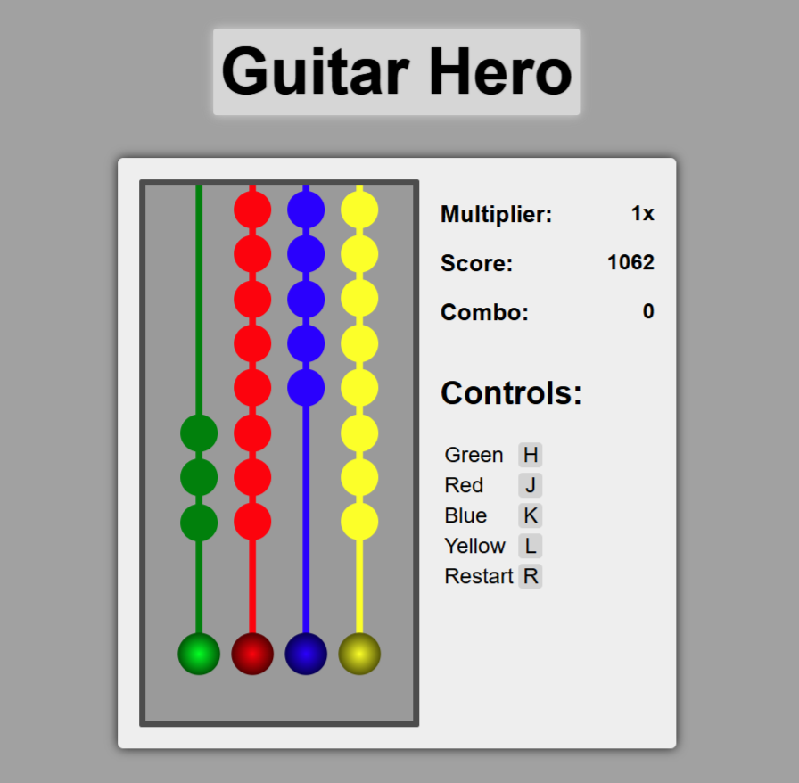

# Guitar Hero

## Description

This is a Guitar Hero inspired game built using Typescript. It is implemented in a functional reactive programming style, using RxJS
observables to handle animations and user input. The game is designed to be played in a web browser, and includes a simple scoring system.

## How to Play
The game board has four columns, in which circles representing notes fall from the top to the bottom. Players must hit the circles by pressing the corresponding keys of `H`, `J`, `K`, `L` on the keyboard at the right time to play notes. The game is played to the song RockinRobin, which is in the public domain. Circles fall in sync with the music.

Each time a key is pressed, if the circles align with the bottom of the game board, the note's sound is correctly played and the player gains 10 points. Invalid key presses result in a miss, which plays a random sound instead.

The circles of notes longer than 1 second have a tail. The player must hold the key down for the duration of the note to score points. If the player releases the key too early, the note stops playing and is counted as a miss.

The player starts off with a score multplier of 1x. The score multiplier increases by 0.2 for every 10 consecutive notes played
correctly (e.g., 10 notes = 1.2x, 20 notes = 1.4x). Invalid key presses or missed notes reset the score multiplier back to 1x.

The game ends when the song is finished. Players can choose to restart the game at any point by pressing the `R` key.


## Setup

**1. Install packages and dependencies**

Make sure you have Node.js installed. Then, in the project directory, run:

```bash
> npm install
```

**2. Start the development server**

```bash
> npm run dev
```
This runs the game locally. You should see output similar to:
```bash
➜  Local:   http://localhost:5173/
```

**3. Open the game in your browser**

Use the link provided in the terminal to open the game in your web browser.

**4. Start the game**

Click anywhere on the page to start the game.